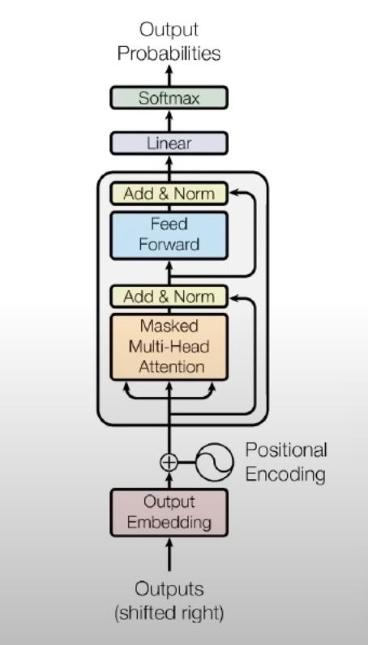
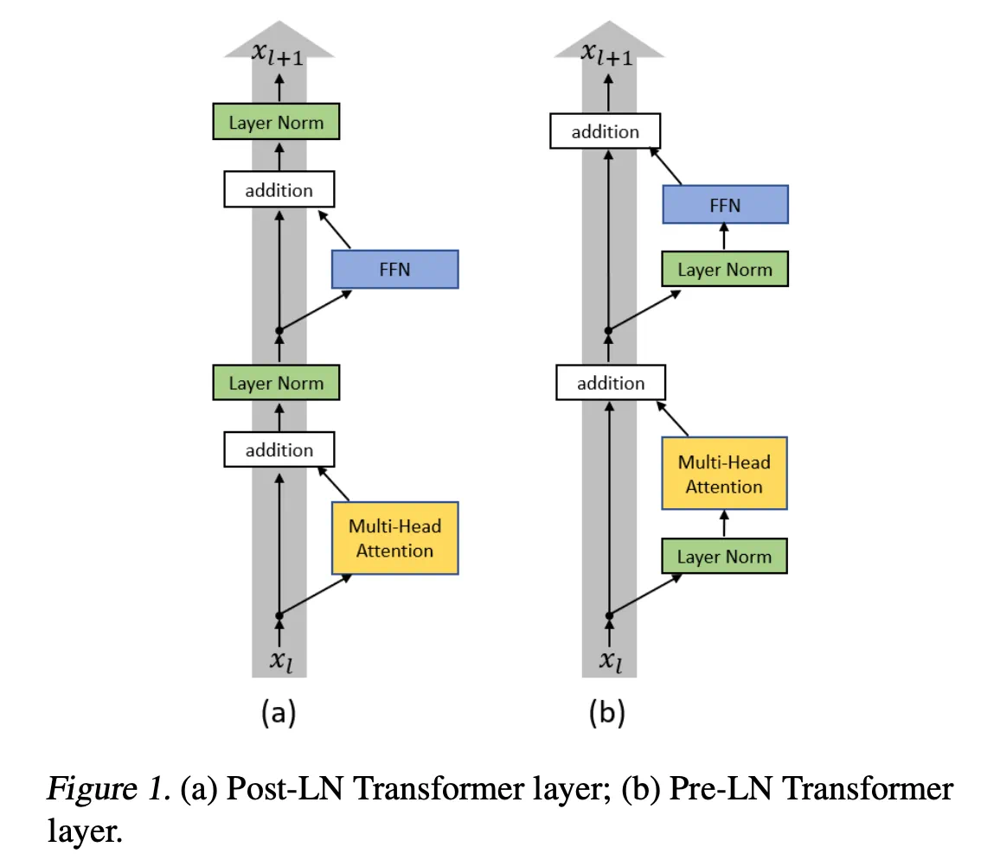
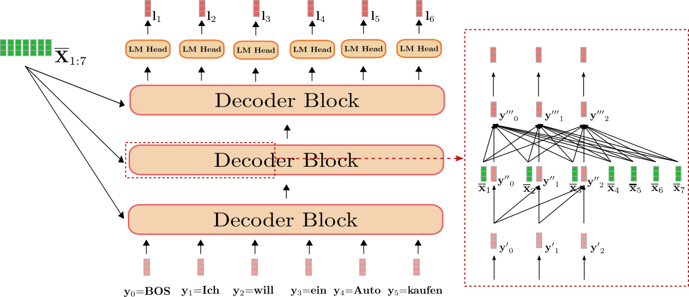
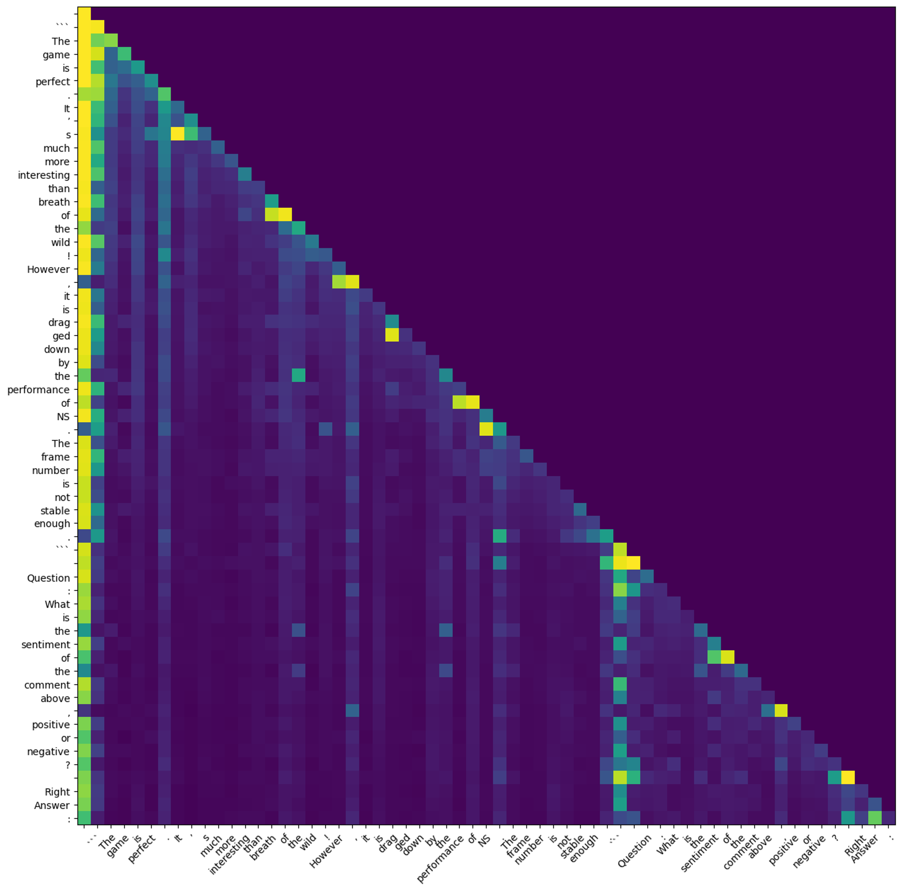
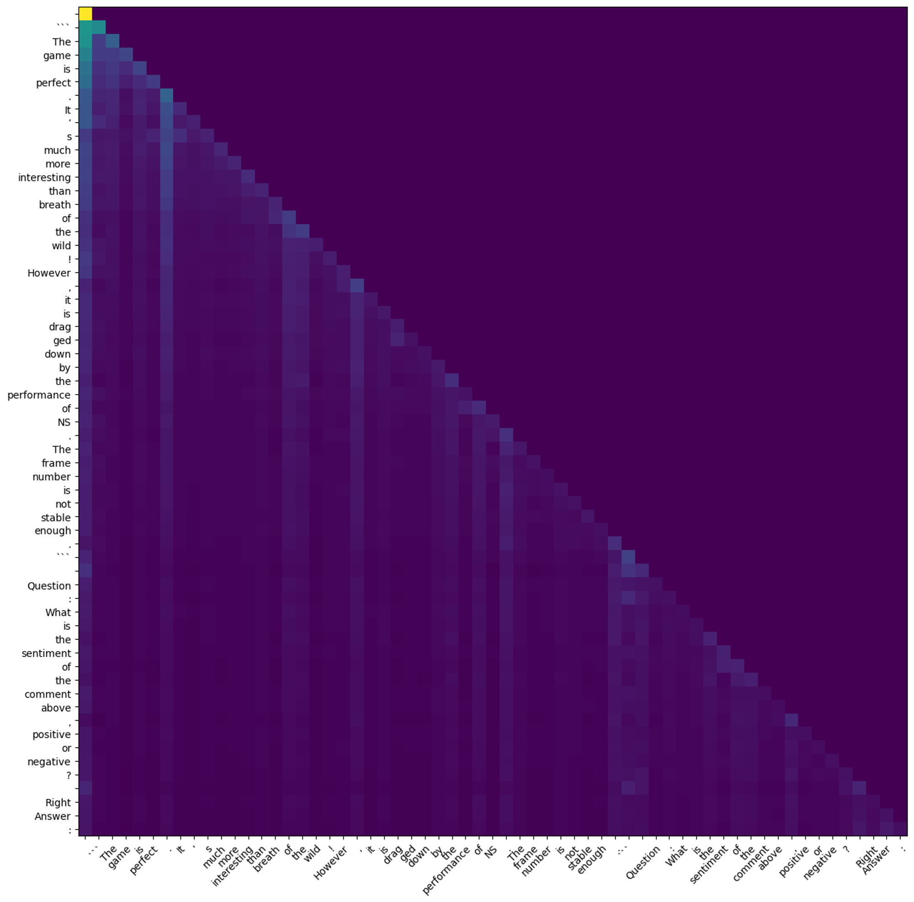

> Knowledge from **reading a paper** is shallow;  
> to truly understand, you must **run it** yourself.  
>
> -- <cite>You Lu</cite>


# Why Do I Write This Article?  
  
Transformers are the foundation of modern language models. As of 2023, there are many ways to learn about transformers, to name just a few:

1. **Read papers:** I have read the original [Transformer paper](https://arxiv.org/abs/1706.03762) and some other papers, such as BERT, T5 and GPT. This method has several drawbacks. Firstly, it is inefficient. Papers often use difficult language to explain simple problems, and include a lot of irrelevant content. Secondly, papers tend to omit many crucial details, which could lead to inaccurate understanding.  
2. **Read blogs and watch video tutorials:** For example, [The Illustrated Transformer](http://jalammar.github.io/illustrated-transformer/). Blog posts are easier to understand than papers, but they are second-hand information from unreliable sources, and the accuracy of the information cannot be guaranteed.  
3. **Study sample codes:** A relatively well-known example is [Transformer from scratch](https://peterbloem.nl/blog/transformers). Implementing the Transformer from scratch is very powerful way of understanding the model. However, this codebase is designed for educational purposes, which has many differences from the code used by companies in real applications. Therefore, it is not ready to use for production.  

## Why LLaMA?
Is there a way in which one can both accurately understand the principles of Transformer and apply it to real work? I came up with a solution: to understand a Transformer code that is actually used in production and has achieved world-class results. Here, I chose [LLaMA](https://github.com/facebookresearch/llama) open-sourced by Meta, since it's open source and widely adopted by many derived models such as ChatGLM, Alpaca, Vicuna, etc.

# Prerequisites

This blog post assumes the reader has basic understanding of the original Transformer. If not, one may refer to [Attention is all you need](https://arxiv.org/abs/1706.03762) first.

# How LLaMA is different from the original Transformer    
1. LLaMA is a **decoder-only** transformer (similar to GPT), meaning it has no encoder, and thus no cross-attention. Note that in the diagram of the model architecture below, the input to the model is called "outputs (shifted right)", because the input and output of the decoder are effectively the same thing, with the output of the **current step** being the input of the **next step**.


2. **Pre-Normalization**. The figure above demonstrates the original transformer, where normalization is applied to the output. Modern Transformers apply normalization to the input. The diagram below shows the difference between the two:



With pseudo code:
```python
# original transformer (post-normalization)
h = norm(x + attn(x))
out = norm(h + ffn(h))

# pre-normalization
h = x + attn(norm(x))
out = h + ffn(norm(x))
```

3. Rotary Positional Embedding (RoPE). Currently, relative positional embeddings are quite popular. I presume this is partly because the context length is getting longer and longer. If absolute positions are used, the uneven distribution of training data lengths may lead to insufficient training of PE at certain positions. On the other hand, considering that the meaning of a phrase would not change when it is shifted in a sentence, relative positional embeddings seem to be more intuitive.  
**The intuition behind RoPE**: Suppose there is a positional embedding function $f(x, l)$ that represents the embedding of input $x$ at position $l$. We want the dot product of $f(q, m)$ and $f(k, n)$ to depend only on the relative position $(m-n)$. Therefore, as long as we can express the embedding as a complex number $f(x, l) = xe^{il}$, where position $l$ is the angle of the complex number, we can ensure the above point.
4. Activation function and normalization function are different from the original Transformer: a minor detail that won't be discussed in this post.

# An Analysis of the LLaMA Code  
The [LLaMA](https://github.com/facebookresearch/llama) codebase is straightforward and can be broadly divided into three sections:  
- [generation.py](https://github.com/facebookresearch/llama/blob/main/llama/generation.py) - this contains the implementation of sampling  
- [model.py](https://github.com/facebookresearch/llama/blob/main/llama/model.py) - this contains the implementation of the transformer model
- [tokenizer.py](https://github.com/facebookresearch/llama/blob/main/llama/tokenizer.py) - this contains the implementation of the tokenizer. The tokenizer is a fairly standard SentencePiece tokenizer (vocab_size=32000). Since there are a lot of information about it on the internet, we will not explain it further for the purposes of this document.  

Let's analyze the sampling and model sections in turn:

## Sampling
Common decoding approaches include beam search and temperature sampling. Beam search tends to produce reliable and accurate results, widely used in translation applications; temperature sampling, on the other hand, introduces randomness, leading to a broader range of possible outcomes, commonly seen in chatbot applications. LLaMA's open-source code utilizes the latter approach.  

The temperature sampling procedure is as follows:  
  
1. Convert the prompt into a list of integers (tokens) using the SentencePiece tokenizer.  
2. Feed the tokens into the transformer model, which outputs a sequence of logits of length equal to the vocabulary size.  
3. Divide the logits by the temperature and apply the softmax function to obtain a probability distribution. This implies that:  
	- A temperature of 1 indicates direct sampling from the model's output distribution.  
	- A temperature of 0 corresponds to selecting the token with the highest probability (also known as greedy sampling, which often yields suboptimal results).  
	- A temperature between 0 and 1 implies sampling from the model's output distribution while favoring (with bias towards) tokens with higher probabilities.  
	- A temperature above 1 (uncommon) "flattens" the model's output probabilities (reducing high values and increasing low values) before sampling; as the temperature approaches infinity, sampling becomes uniform.  
4. Sample the next token from the distribution and append it to the end of the input token sequence.  
5. Repeat steps 2-4 until the maximum sequence length is reached or an end-of-sequence (EOS) token is generated.  

To express this in pseudocode:
```python
def generate(prompt, temperature):
	tokens = tokenizer.encode(prompt)
	while len(tokens) < MAX_CONTEXT_LENGTH:
		logits = model(tokens)
		logits /= temperature
		logits = topk(logits)
		next_token = sample(softmax(logits))
	    if next_token = eos:
		    break
	tokens.append(next_token)
	return tokenizer.decode(tokens)
```

Since the sampling process is step by step, if the result is long, it can be returned asynchronously. Combined with the technology of HTTP long connection, the effect of outputting one word at a time like ChatGPT can be achieved.  

In terms of sampling, there is actually no difference between LLaMA and the original Transformer, or any other language model. However, I still found some issues that I had never thought about before, such as:  
  
1. In the pseudo code, for each step, the input of the model is `tokens[:t]`, and the output is `tokens[t+1]` (logits). This is theoretically correct, but is it true in practice?  
  
The official code implementation of LLaMA is [here](https://github.com/facebookresearch/llama/blob/57b0eb62de0636e75af471e49e2f1862d908d9d8/llama/generation.py#L39):
```python
start_pos = min_prompt_size
prev_pos = 0
for cur_pos in range(start_pos, total_len):    
	logits = self.model.forward(tokens[:, prev_pos:cur_pos], prev_pos)
	# ...    
	tokens[:, cur_pos] = next_token    
	prev_pos = cur_pos
```

As we can see, only when the first output token is generated, the model's input is `tokens[:t]`, while in each subsequent step, the model only takes the last token as input. Why is this the case?

If we consider the difference between step t and step t+1 with reference to the figure above, we can see that for each layer of the decoder, the first t steps of (q, k, v) and output actually remain unchanged. For step t+1, we are only concerned with the output of the last position, since we already know the previous results. And the output of the last position is only related to `attention(q[-1], k[:t], v[:t])`. Therefore, the attention part of `q[:t]` does not need to be recalculated, we only need to cache `k[:t]` and `v[:t]`.

2. What's the difference between batch prediction and single prediction?  
  
If you further study the generate code, you will find that batch prediction is not necessarily more efficient than single prediction! Can you explain what the highlighted code below is doing?

```python hl:6-8 {linenos=false,hl_lines=["6-8"],linenostart=1}
start_pos = min_prompt_size
prev_pos = 0
for cur_pos in range(start_pos, total_len):
    logits = ...
    # only replace token if prompt has already been generated
    next_token = torch.where(
        input_text_mask[:, cur_pos], tokens[:, cur_pos], next_token
    )
    tokens[:, cur_pos] = next_token
    prev_pos = cur_pos

decoded = []
for i, t in enumerate(tokens.tolist()):
    # cut to max gen len
    t = t[: len(prompt_tokens[i]) + max_gen_len]
    # cut to eos tok if any
    try:
        t = t[: t.index(self.tokenizer.eos_id)]
    except ValueError:
        pass
    decoded.append(self.tokenizer.decode(t))
```

In theory, batch prediction is more efficient than single prediction because it multiple prompts can be processed by the model at once and take advantage of the GPU's parallel computing capabilities. However, in practice, this is not always the case:  
  
1. In single prediction, the process can be terminated once the EOS (end-of-sentence) token is encountered. However, in batch prediction, it is not possible to know in advance how long the output will be, so a maximum length must be specified and the output must be cut off at the EOS position. This inevitably results in wasted computation.  
2. For single prediction, the process can start from the end of the prompt. However, for batch prediction, the process must start from the end of the shortest prompt, and care must be taken not to overwrite the existing prompts (this is where `torch.where` is used in the code above).  Therefore, some implementations use left-side padding and align the inputs to the right.

## Transformer Model

Take the 7B model as an example, the model parameters are as follows:  
- **dim**=4096 The input and output size of each layer of the Transformer (Decoder Layer) (batch_size, seq_len, dim)  
- **n_layers**=32 The number of Decoders  
- **n_heads**=32 The number of heads in multihead attention.  
- **head_dim** = dim / n_heads = 4096 / 32 = 128 (can be inferred from dim and n_heads)  
- **vocab_size**=32000 The number of tokens in the Vocabulary

### class [Transformer](https://github.com/facebookresearch/llama/blob/57b0eb62de0636e75af471e49e2f1862d908d9d8/llama/model.py#L223)

This class contains the overall logic of Transformer.  
  
**Input**  
- tokens: (batch_size, seq_len) Input tokens, as analyzed in the previous section, the entire prompt is input when called for the first time, seq_len = min_prompt_length; Each subsequent input is the last generated token, seq_len=1.  
- start_pos: int The input is the starting position of the token, which is 0 when called for the first time, and the current output position for subsequent calls.  
  
**Output**  
(batch_size, vocab_size) Next token logits for each prompt.  
  
The logic of Transformer is as follows:
```python hl:17-18 {linenos=false,hl_lines=["17-18"],linenostart=1}
# token to embedding
# tokens (batch_size, seq_len) 
# embedding (batch_size, seq_len, dim)
h = self.tok_embeddings(tokens)

# "complex numbers" for Positional embedding (RoPE)
# shape: (seq_len, head_dim/2)
freqs_cis = ... 

# Attention Mask  
# During the first call, the mask is a triangular matrix (causal attention mask, shape t x t)  
# For subsequent steps, mask=None, because the input only has the last token, which can interact with any previous k, v.
mask = ...  

# Decoder layers x 32
# input shape = output shape (batch_size, seq_len, dim)
for layer in self.layers:
    h = layer(h, start_pos, freqs_cis, mask)

# RMSNorm (batch_size, seq_len, dim)
h = self.norm(h)

# Output layer
# embedding(dim) => logits(vocab_size)
# only compute last logits (batch_size, 1, vocab_size)
output = self.output(h[:, -1, :])  
return output.float()
```

In the code above, tok_embeddings and output are just ordinary Feed Forward.  
We won't discuss about RMS normalization in this article.

### class [TransformerBlock](https://github.com/facebookresearch/llama/blob/57b0eb62de0636e75af471e49e2f1862d908d9d8/llama/model.py#L178)
This class contains the implementation of the Decoder layer (the highlighted part in the code above).  
  
**Input**  
  
- **x: (batch_size, seq_len, dim)**  this is called h in the Transformer paper, i.e. the input token embedding  
- **start_pos: int** the starting position of the input token, 0 for the first call, and the current output position for subsequent calls.  
- **freqs_cis: (seq_len, head_dim/2)** the pre-computed "complex number" $e^{il}$ of the RoPE embedding for each position. (Since a complex number is two numbers, hence head_dim/2). The computation of RoPE can be found in the function [apply_rotary_emb](https://github.com/facebookresearch/llama/blob/57b0eb62de0636e75af471e49e2f1862d908d9d8/llama/model.py#L63), which basically converts xq, xv to complex numbers first and then directly multiplies them with freqs_cis.  
- **mask**: causal attention mask. In the first call, the mask is a triangular matrix (causal attention mask, shape t x t). In subsequent calls, mask=None, since the input has only the last token, which can attend to any previous k, v.  
  
**Output**  
  
(batch_size, seq_len, dim) the output of the Decoder block, which is also the input to the next Decoder block (so the output shape is the same as the input).  
  
The logic of the Decoder Layer is quite straightforward, almost the same as the pseudo-code above, except that it passes in start_pos, RoPE, mask, etc.

```python
h = x + self.attention.forward(self.attention_norm(x), start_pos, freqs_cis, mask)
out = h + self.feed_forward.forward(self.ffn_norm(h))
return out
```

There are three types of layers in TransformerBlock: attention, feed_forward, and norm. Since the other two are fairly straightforward, we will only analyze Attention.

### class [Attention](https://github.com/facebookresearch/llama/blob/57b0eb62de0636e75af471e49e2f1862d908d9d8/llama/model.py#L119)

Now comes the Attention layers, considered the most critical structure in Transformer.  
  
Since attention is the first layer in the decoder blocks (excluding the norm that does not change the shape), its input and output shapes are the same as described in the Decoder Layer above, so we will not repeat it here. Instead, let's focus on what it calculates:  
  
1. Split the embedding into multiple heads, changing the shape from (batch_size, seq_len, dim) to (batch_size, seq_len, n_heads, head_dim):

```python
xq = xq.view(bsz, seqlen, self.n_local_heads, self.head_dim)xk = xk.view(bsz, seqlen, self.n_local_heads, self.head_dim)xv = xv.view(bsz, seqlen, self.n_local_heads, self.head_dim)
```

2. Calculate positional embedding according to the definition of RoPE. One detail: only query and key have positional embeddings, while value does not.

```python
xq, xk = apply_rotary_emb(xq, xk, freqs_cis=freqs_cis)
```

3. Retrieve the k and v of the previous t-1 steps from the kv cache, and merge them with the k and v of the current step

```python
self.cache_k = self.cache_k.to(xq)
self.cache_v = self.cache_v.to(xq)

self.cache_k[:bsz, start_pos : start_pos + seqlen] = xk
self.cache_v[:bsz, start_pos : start_pos + seqlen] = xv

keys = self.cache_k[:bsz, : start_pos + seqlen]
values = self.cache_v[:bsz, : start_pos + seqlen]
```

4. Finally, compute multi head attention:

```python
xq = xq.transpose(1, 2)
keys = keys.transpose(1, 2)
values = values.transpose(1, 2)
scores = torch.matmul(xq, keys.transpose(2, 3)) / math.sqrt(self.head_dim)
if mask is not None:
    scores = scores + mask  # (bs, n_local_heads, slen, cache_len + slen)
scores = F.softmax(scores.float(), dim=-1).type_as(xq)
output = torch.matmul(scores, values)  # (bs, n_local_heads, slen, head_dim)
output = output.transpose(
    1, 2
).contiguous().view(bsz, seqlen, -1)

return self.wo(output)
```

Let's further analyze the relationship between multi-head attention and single-head attention.  
  
For multi-head attention, the computation process is as follows:  
1. Transpose the head dimension of q, k, and v to the front (batch_size, seq_len, n_heads, head_dim) ⇒ (batch_size, n_heads, seq_len, head_dim).  
2. Regard batch_size and n_heads as a whole batch dimension, and then calculate score = (q * k.T) / sqrt(head_dim).  
3. output = score * v.  
4. Transpose the head of output back, and then merge multiple heads. (batch_size, n_heads, seq_len, head_dim) ⇒ (batch_size, seq_len, n_heads, head_dim) ⇒ (batch_size, seq_len, dim).  
  
Without considering the batch dimension:  
- The matrix multiplication in single-head attention is (seq_len, dim) * (dim, seq_len), with a complexity of O(seq_len^2 * dim).  
- For multi-head attention, its matrix multiplication consists of n_head independent (seq_len, head_dim) * (head_dim, seq_len).  
  
The complexity is O(n_head * seq_len^2 * head_dim) = O(seq_len^2 * dim).  
  
Therefore, multi-head attention is essentially equivalent to splitting the embedding into n parts, and then performing attention on each part separately. The overall computational complexity is the same as single-head attention.

# Experiment  
  
## On Memory Usage  
  
Theoretically, the memory usage of a 7B model is about 7x2 = **14GB** (using float16). However, if we run the official LLaMA code, we find that the memory usage is **22GB**. How is the extra memory used? As mentioned earlier, there is a kv cache during inference.  
  
The size of the key/value cache for each decoder layer is:  
  
(max_batch_size, max_seq_len, n_heads, head_dim) = \[32, 512, 32, 128\]  
  
So the total cache size is  
  
2 (k, v caches) * 32 (layers) * 32 (max batch size) * 512 (max seq len) * 32 (number of heads) * 128 (head dim) * 2bytes/param = **8G**  
  
Adding this to the model's 14GB, we get around 22GB. Therefore, the main way to reduce memory usage is to reduce the max batch size and max sequence length. For a chatbot, this is not a problem, as we can simply set the batch size to 1.  
  
In the recently released [Falcon](https://github.com/huggingface/blog/blob/main/falcon.md#the-falcon-models) model, [multi-query attention](https://arxiv.org/pdf/1911.02150.pdf) (7B) and [group query attention](https://arxiv.org/pdf/2305.13245.pdf) (40B) are used, which share keys and values among multiple heads (the queries for each head are still different), reducing the size of the k v cache and thus reducing the memory usage during inference. [Here](https://github.com/Lightning-AI/lit-parrot/blob/0368dbb0316d1bfb0addd6aa1126f1fedcb8f413/lit_parrot/config.py#L10) is an intuitive explanation of multi/group query attention.

## Prompting

Here we use LLaMA's inference code to perform sentiment analysis.  
  
Let's take some reviews of "The Legend of Zelda: Tears of the Kingdom" from [Metacritic](https://www.metacritic.com/game/switch/the-legend-of-zelda-tears-of-the-kingdom), and then let LLaMA judge whether the reviews are positive or negative. Note that LLaMA is a **language model** rather than a **ChatBot**, so we need to use the task of **completion** to prompt it, rather than **asking it questions**.  
### Exp 1  
  
We use the following prompt, expecting the model to output positive or negative:

```
`The game is perfect. It’s much more interesting than breath of the wild! However, it is dragged down by the performance of NS. The frame number is not stable enough.`

The sentiment of the comment above is
```

However, things didn't go as expected. The model output was:

> The sentiment of the comment above is **not uncommon**

Therefore, we found **disadvantage 1** of using LM (compared to traditional classification) for sentiment analysis: the model's output is too flexible, so it does not necessarily output the answer format we want.

### Exp 2

Let's modify the prompt:

```
`The game is perfect. It’s much more interesting than breath of the wild! However, it is dragged down by the performance of NS. The frame number is not stable enough.`

Question: What is the sentiment of the comment above, positive or negative?  
Right Answer:
```

This time the model outputs:

> Right Answer: **Negative**

After experimenting with several other comments, I found that the model was able to stably output positive or negative results. This basically solved drawback 1, but there is still a problem: in traditional classification, the model can output a value between 0 and 1, which represents the model's confidence in whether it is negative or positive. If a generative model is used, only the label is output, and there is no way to know the model's confidence. In the above example, the first part of the comment is actually positive, while the second part is negative, making it difficult to summarize in a single word. This is **drawback 2** of using generative models for sentiment analysis.

## Scoring

So, is there a way for LLaMA to output a score representing the confidence or likelihood of the result at the same time? We know that the logits of the output of each step of the LM are p(x[t] | x[:t]), so we can get a score by adding the log_softmax:
```python
class LLaMA:
    ...

	def score(
		self,
		prompt: str,
		answer: str,
	):  
		score = 0
		prompt_tokens = torch.tensor(self.tokenizer.encode(prompt, bos=True, eos=False)).cuda().long().reshape((1,-1))
		answer_tokens = torch.tensor(self.tokenizer.encode(answer, bos=False, eos=False)).cuda().long().reshape((1,-1))
		
		# first answer token        
		logits = self.model.forward(prompt_tokens, 0)
		score += torch.log_softmax(logits, dim=-1)[0, answer_tokens[0, 0]]
		
		for pos in range(answer_tokens.shape[-1]-1):
			logits = self.model.forward(answer_tokens[:, pos:pos+1], prompt_tokens.shape[-1])
			score += torch.log_softmax(logits, dim=-1)[0, answer_tokens[0, pos+1]]
		
		return score
```

With this score, we can calculate `score(prompt, "Negative")` and `score(prompt, "Positive")` separately, and then calculate a softmax to get a value between 0 and 1, which represents its emotional positive and negative values.  
  
The following are some experimental results of scoring:

```
`The game is perfect. It’s much more interesting than breath of the wild! However, it is dragged down by the performance of NS. The frame number is not stable enough.`
```
>softmax = [positive=0.2613, negative=0.7387], score_pos=-2.2791, score_neg=-1.2401

```
`The perfect game, loads of mechanics and incredible creativity Definitely the game of the year`
```
>softmax = [positive=0.5868, negative=0.4132], score_pos=-1.4431, score_neg=-1.7939

```
`2000 graphics, awful gameplay, reused map from the last game. Overpriced dlc to an already terrible game, not unusal from nintendo to produce terrible games, reuse 20 years assets and sell the game for a huge markup. Story 0/10, gameplay 0/10, graphics 0/10.`
```
>softmax = [positive=0.1095, negative=0.8905], score_pos=-3.0722, score_neg=-0.9763

It's worth noting that such scoring is still quite different from traditional classification, for the following reasons:  
  
1. The output range of the LLM is the entire vocabulary. Therefore, if you observe the entire logit, the probabilities of outputting Positive and Negative are relatively high, higher than the probabilities of outputting other tokens. Here, we are essentially comparing the probabilities of the model outputting "Positive" and "Negative" to give a score.  
2. The premise of scoring is that you have to predict what the model will output. For example, even for a positive example, score("Negative") will be higher than score("positive" in lowercase), because the probability of the answer being capitalized is higher in the model's probability distribution.  
3. The score is related to the length of the answer sentence. (The longer the token length, the lower the probability) If the lengths of two answers are different, we cannot simply compare them using the score.  
4. There is another subtle issue, Positive and Negative will be segmented by SentencePiece into \[Pos, itive\] and \[Neg, ative\].  
  
Therefore

$$
score(prompt, Positive) = score(Pos | prompt) \cdot score(itive | prompt, Pos)
$$
$$
score(prompt, Negative) = score(Neg | prompt) \cdot score(ative | prompt, Neg)
$$

If the correct answer in our mind is Positive, then the model output score(Pos | p) > score(Neg | p) is fine. However, in the second step, since it is assumed that the model has output Neg, it is very likely that score(ative | p, Neg) > score(itive | p, Neg). Therefore, the score of this step is actually not very meaningful.

## Attention Weights Analysis

One way to analyze the transformer is to print out the attention weights matrix and see how much attention is paid between each token. Since LLaMA uses multi-head attention, there are actually 32 different weight matrices (seq_len x seq_len) for n_heads = 32. Here, we take a simple and crude approach by directly taking the average or maximum value of each head for analysis. (A more sophisticated method is proposed in [this paper](https://aclanthology.org/P19-1580.pdf), but I haven't studied it carefully yet.) It should also be noted that we only study the attention weight matrix of the first layer (the layer closest to the input).  
  
Note: Attention weights are in this [score](https://github.com/facebookresearch/llama/blob/57b0eb62de0636e75af471e49e2f1862d908d9d8/llama/model.py#L141) variable.  
  
Take this sentence as an example:

```The game is perfect. It’s much more interesting than breath of the wild! However, it is dragged down by the performance of NS. The frame number is not stable enough.```

> Question: What is the sentiment of the comment above, positive or negative?  
> Right Answer:

When the model reads to the end, the output max attention and average attention are 

max attention


average attention

At first glance, there seems to be no particular pattern, but if we print the attention of the word "sentiment" and other words separately, we will find the following scores:

```
sentiment 0.08599853515625
 0.06610107421875
. 0.049346923828125
``` 0.048248291015625
. 0.0439453125

 0.043304443359375
the 0.039154052734375
, 0.033111572265625
of 0.032073974609375
. 0.0291748046875
: 0.0286102294921875
of 0.0279388427734375
the 0.0266571044921875
the 0.023712158203125
is 0.022430419921875
Question 0.0214691162109375
What 0.0204925537109375
by 0.0200653076171875
The 0.017822265625
is 0.0173797607421875
is 0.0164031982421875
``` 0.0159759521484375
stable 0.0150604248046875
than 0.0137939453125
not 0.01311492919921875
enough 0.01275634765625
is 0.01256561279296875
The 0.01212310791015625
! 0.0118865966796875
However 0.01165008544921875
frame 0.01100921630859375
interesting 0.01088714599609375
s 0.01052093505859375
number 0.0103302001953125
NS 0.010101318359375
drag 0.01001739501953125
it 0.00986480712890625
performance 0.00970458984375
It 0.009613037109375
breath 0.009246826171875
perfect 0.00911712646484375
ged 0.00904083251953125
more 0.00893402099609375
down 0.00890350341796875
much 0.00856781005859375
wild 0.0082550048828125
’ 0.0073394775390625
game 0.006198883056640625
the 0.0
positive 0.0
or 0.0
of 0.0
negative 0.0
comment 0.0
above 0.0
Right 0.0
Answer 0.0
? 0.0
: 0.0
, 0.0
```

After removing the high-ranking but meaningless words, we can see that the scores of words like "not stable enough" and "However" are higher than words like "perfect" and "interesting". This can partly explain why the model thinks the sentiment of this review is more negative than positive (of course, in terms of the result, the model's judgment here is wrong, because this review gave a score of 10 later).

## About Other Open Source Models

In addition to LLaMA and the aforementioned Falcon, there are many other open-source models, such as Vicuna and Alpaca, which are exactly the same as LLaMA, and StableLM, RedPajama, Pythia, etc., which are slightly different. In fact, the differences between these models are so small (differences in individual parameters and datasets) that they can share [a set of code](https://github.com/Lightning-AI/lit-parrot) for implementation.

# Future Work

This article only analyzes the code for the inference part, as the official version does not provide the training part. Compared with inference, training has the following differences:  
  
1. Since the data is known, the training is completely parallel: the input is `tokens[:t]`, and the output is `tokens[1:t+1]`.  
2. Training includes an optimizer (LLaMA uses AdamW).  
3. Training requires a lot of computing resources (large amounts of data, large batch sizes, multiple GPUs in parallel). Ordinary people can't afford it at all.  
  
However, fine-tuning and adapter tuning of small datasets are still possible. If you are interested, you can refer to [Lit-LLaMA](https://github.com/Lightning-AI/lit-llama).