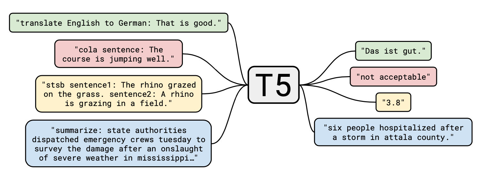
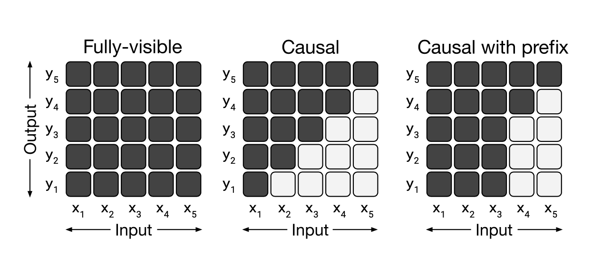
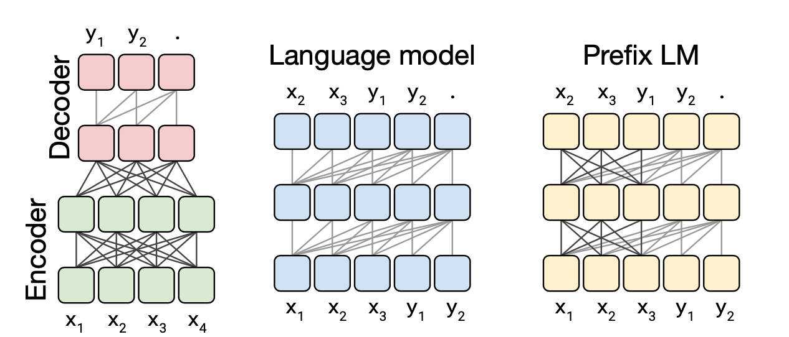

Paper: [https://arxiv.org/abs/1910.10683](https://arxiv.org/abs/1910.10683)

{}
Note from 2023: Almost 3 years later, large models GPT and PaLM have become the mainstream of LLMs. However, this paper is still worth reading as T5 remains to be a common choice for industry deployments.
{}

# 1. Introduction

This section introduces the background and goal of T5. As illustrated in the figure, T5 is a text-to-text model that directly takes the task name and the question as input, and outputs the answer. The advantage of this design is that the same model can be used to solve different problems, enabling multi-task learning.

# 2. Setup

This section will walk through the models and datasets used in T5.

## 2.1 Model

This section introduces the models employed in T5. Some earlier models were based on RNNs; ULMFiT is cited here as an example. Today, there seems to be a perception that RNNs (including LSTMs) are passé and that Transformers are *de rigueur*. I disagree with this perception: if you are resource-constrained and want to pretrain, ULMFiT is still an excellent choice, achieving remarkable results on relatively small datasets and with a single GPU. Also, Transformers do not outperform RNNs due to some fundamental conceptual superiority, but rather because they are easier to scale to very large models and datasets (perhaps analogous to the reasons DNNs beat XGBoost for very large scale recommender systems). If someone were to invent a way to train RNNs much faster, they might yet make a comeback; indeed, there are aspects of the Transformer-XL architecture that suggest RNNs may be due for a renaissance.

{}
Note from 2023: As of today, RNNs have largely been supplanted by Transformers, but the ideas behind RNNs have endured. In fact, the strategy of parameter sharing heavily employed in many efficient Transformer architectures is inspired by ideas that are closely related to RNNs.
{}

T5 is based on the Transformer. Unlike BERT, which only uses a Transformer Encoder, T5 uses both an encoder and a decoder, and casts all problems as text-to-text.

{}
Note from 2023: As of today, the popularity of LLMs and generative tasks has given rise to decoder-only architectures, such as GPT, PaLM, and LLaMA. In my opinion, decoder-only architectures are more streamlined and require fewer hyper-parameters to tune (e.g., how many parameters should be allocated to the encoder vs. the decoder?) than encoder-decoder architectures, and are somewhat more versatile.
{}

T5’s Transformer differs slightly from the original version in the following ways:

1. Removal of layer norm bias.
2. Normalization outside of the residual path. (The original Transformer performs an add(input, output) and then a normalization, whereas here a norm(input) is performed and then an add(input, output). The semantics are roughly equivalent.)
3. Use of relative position embeddings.

The paper also notes that they did not experimentally verify the impact of these modifications on performance.

{}
Note from 2023: The recent [LLaMA]() model from Meta also uses pre-normalization and relative position embedding. This suggests that core Transformer architectures have remained largely unchanged over the past few years.
{}

## 2.2 The Colossal Clean Crawled Corpus

This section introduces C4, the dataset used for pretraining T5. C4 is a subset of Common Crawl that **contains only English text data** (as determined by langdetect) and has undergone several rounds of cleaning to remove duplicate, low-quality articles, reducing its size from 20 TB to 750 GB. The specific processing procedures are detailed in the paper.

The fact that pretraining was performed only on English text may be the reason for T5's relatively poor performance on translation tasks.

## 2.3 Downstream Tasks

This section describes the tasks used for fine-tuning, including GLUE, SuperGLUE, SQuAD, WMT, and others.

## 2.4 Input and Output Format

This section explains how datasets for various tasks are transformed into the input format used by T5.

For example:

1. For translation tasks, the input is "translate English to German: That is good." and the output is "Das ist gut."
2. For classification tasks, the output is simply the label.

And so on.

 # 3. Experiments

The largest model of T5 has **11B** parameters. It is infeasible to iterate on such a large model repeatedly during experimentation and hyperparameter tuning. Therefore, the T5 team conducted a set of experiments on a much smaller model prior to pretraining, with the goal of discovering the most promising model configurations and pretraining tasks. They began with a baseline model and built upon it with various experiments, observing how these affected performance on fine-tuned tasks.

{}
As of 2023, the open-source LLaMA models are available in 7B and 13B sizes, and a model with approximately 10B parameters is now fairly standard.
{}

These experiments explored:

1. Model architectures (Section 3.2)
2. Unsupervised objectives (Section 3.3)
3. Pretraining data sets (Section 3.4)
4. Transfer approaches (Section 3.5)
5. Scaling (Section 3.6)

## 3.1 Baseline

In this section, we introduce the baseline model.

### 3.1.1 Model

The experiments made use of an encoder-decoder Transformer model. This architecture is largely identical to BERT-base, resulting in roughly 2x the number of parameters.

{}
Note that this is the model used for experimentation and is not the final T5 model.
{}

### 3.1.2 Training

Here the authors detail the hyperparameters used during training. One interesting aspect of this section is that they justify how certain hyperparameters, such as the number of steps, were chosen.

With a sequence length of 512 and a batch size of 128, each batch contained approximately $512 \times 128 = 65536 = 2^{16}$ tokens, after utilizing a technique called packing[^packing]. They trained for $2^{19}$ steps, exposing the model to $2^{35} = 34\text{B}$ tokens in total. This model was still trained on C4, which has significantly more than $34\text{B}$ tokens. Therefore, the model never saw any repeated data.

[^packing]: A technique that combines as many sequences as possible (total length roughly equal to `seq_len`) into a single example to conserve computational resources.

For the pretraining learning rate, the authors used $learningRate = 1/\sqrt{max(n, k)}$, where $n$ is the step number and $k$ is a constant equal to $10^4$. They also mention that a triangular learning rate, as proposed by Howard and colleagues, performs slightly better. (As an aside, I highly recommend checking out fast.ai for more information on this; Howard has successfully applied this technique to both image and NLP models.) The reason this schedule was not used in the experiments here is because some experiments varied the number of training steps, whereas the triangular schedule requires knowing the total number of steps in advance.

During fine-tuning, the authors trained for $2^{18}$ steps. This was chosen as a compromise given the varying sizes of the fine-tuning datasets. A constant learning rate of $0.001$ was used. Checkpoints were saved and evaluated every 5,000 steps, and the best validation checkpoint was selected. The best performing checkpoint was selected independently for each task.

### 3.1.3 Vocabulary

T5 uses SentencePiece as its tokenization scheme. Since they eventually wanted to explore translation tasks, the vocabulary was also jointly learned on German, French, and Romanian. The final vocabulary size was 32k. As a result, T5 is not well-suited for languages like Chinese and Japanese, because their tokens are not present in the vocabulary and the pretraining data does not contain these languages.

{}
For languages outside of English, such as Chinese and Japanese, you can explore a successor model to T5 called [mT5](https://github.com/google-research/multilingual-t5).
{}

### 3.1.4 Unsupervised Objective
Recent research has shown that a denoising objective is more effective for pretraining than a left-to-right LM. As a result, T5 uses an objective similar to BERT's. However, since T5 is a seq2seq model, rather than masking the inputs like BERT, T5 applies transformations to the outputs. For example:


Note (2023): As of today, both PaLM and GPT have dropped the denoising objective in favor of left-to-right LMs (also known as next token prediction). So this point is no longer entirely accurate. It is possible that left-to-right LMs have simply become powerful enough as model and data sizes have increased by orders of magnitude.


- **Original Text:** Thank you for inviting me to your party last week.
- **Inputs:** Thank you \<x\> me to your party \<y\> week.
- **Outputs:** \<x\> for inviting \<y\> last \<z\>

Specifically, 15% of the tokens are masked, and during output, only the restored tokens are generated.  As the output is much shorter, this reduces the computational cost of pretraining.

### 3.1.5 Baseline Performance
This section presents the performance of the baseline model, both when trained and fine-tuned, as well as how it compares to training from scratch.

The main conclusion is that the performance of the baseline model, when trained and fine-tuned, is significantly better than training from scratch on almost all tasks. This shows that the seq2seq pretraining approach works well.

## 3.2 Architectures
This section begins experimenting with various modifications to the baseline model. The first set of modifications involve the architecture.

### 3.2.1 Model Structures
This section discusses variations in the model’s architecture.

The first is the attention mask, which restricts the attention weights between the inputs and outputs, preventing the output from “peeking” at the answer.

Three types of masks are discussed: fully visible, causal (can only see what came before), and causal with prefix (a certain prefix is fully visible).

Three types of architectures are discussed here: encoder-decoder, language model, and prefix LM. These three are actually related to the previous masks.

For encoder-decoder, since the output and input do not overlap at all, the encoder can use fully visible. The decoder should not look into the future during training, so causal is used. (This mask should be added to the self-attention of the decoder, and the attention between the decoder and the encoder should be fully visible.)

For language models, when predicting the next token, the answer cannot be seen, so a causal mask must be used. Note that the decoder in the encoder-decoder is actually a language model.

Because a token in a language model can only attend to previous tokens, this causes a lot of information to be lost in some tasks such as translation. So prefix LM was introduced to solve this problem. The mask is modified so that a previous section in the input can be fully visible.

The paper also mentions that prefix LM is almost equivalent to BERT in classification tasks. Consider the following example:

BERT: \[CLS\] I hate pigeons. \[SEP\] My feelings towards pigeons are filled with animosity. => entailment

Prefix LM: premise: I hate pigeons. hypothesis: My feelings towards pigeons are filled with animosity. => entailment

In this way, the settings of the masks are the same for both models.

### 3.2.2 Comparing Different Model Structures

When comparing different models, the comparison should be based on similar numbers of parameters and computational costs. However, the problem is that the number of parameters and the computational cost are not directly proportional. For example, for an encoder-decoder model with (L+L) layers, the number of parameters is equivalent to a language model with 2L layers (only decoder), but the computational cost is equivalent to a language model with only L layers. This is because for a language model, it has to compute both the input and the output; while the encoder only computes the input, and the decoder only computes the output. For this reason, when comparing later, both computational cost and number of parameters are listed.

### 3.2.3 Objectives

The objectives used here are denoising (similar to BERT) and language model (predicting the next token).

### 3.2.4 Results

The performance of various experiments is compared in Table 2 according to architecture, objective, number of parameters, and computational cost.

**Conclusion:**

1. The performance of encoder-decoder is better than that of language model and prefix LM, even with the same number of parameters and half the computational cost. Interestingly, even if the parameters of the encoder and decoder are shared, the performance is almost as good.
2. Denoising always performs better than language models.

## 3.3 Unsupervised Objectives

This section explores different attempts at unsupervised objectives.

## 3.3.1 Disparate High-Level Approaches
In terms of the results, BERT performed better than prefix LM and deshuffling, with deshuffling exhibiting the worst performance.

## 3.3.2 Simplifying the BERT Objective
A more nuanced comparison of the various BERT-style approaches was performed. While the performance of the different techniques was fairly similar, replacing corrupted spans was the most effective. This approach performed especially well on the CoLA task, possibly because judging grammar — a key task in the CoLA benchmark — is closely related to missing token prediction.

## 3.3.3 Varying the Corruption Rate
The effects of varying the corruption rate were also examined. Corruption rates between 10% and 25% performed similarly.

## 3.3.4 Corrupting Spans
The impact of span length was assessed using a fixed corruption rate of 15%. Span length had a comparatively minor effect on performance.

## 3.3.5 Discussion
The experimental methodology was summarized. The general approach consisted of considering one variable at a time, with the best-performing approach from each experiment being used in subsequent experiments.
![[t5-objective.png]]
## 3.4 Pre-training Data Set
This section is also quite interesting. It compares the influence of different pre-training datasets.

### 3.4.1 Unlabeled Data Sets
Here we compare different datasets. Interesting findings are as follows: (Note that since we only pre-trained $2^{35} \approx 34B$ tokens, the size of the dataset doesn't reflect the size of the whole training dataset.)

1. C4 (745 GB) performs better than C4 unfiltered (6.1 TB). This demonstrates the importance of data cleaning.
2. WebText-like (17 GB) performs very well. This dataset contains only Reddit content with scores of 3 or more. It means data quality is very important! Reading good books will make you a better person.
3. Wikipedia + Toronto Books Corpus performs well. Using Wikipedia alone is not good enough. This indicates that domain knowledge is very useful.

### 3.4.2 Pre-training Data Set Size
This subsection discusses the influence of dataset size. Under the constraint that the number of training steps is fixed at $step = 2^{35} \approx 34B$ tokens, we truncate C4 to sizes $2^{29}, 2^{27}, 2^{25}, 2^{23}$, which are equivalent to $64, 256, 1024$, and $4096$ epochs, respectively.

Conclusion: The model performance decreases as the dataset size decreases. Combined with the training loss curve analysis, overfitting will occur if the data is repeated too many times. However, when the dataset is repeated 64 times, the model's performance degradation is not obvious. This indicates that a small number of repetitions (slightly more training epochs) have little impact on the performance. However, for pre-training, since unlabeled data is relatively easy to obtain, it is always better to use more data.

Empirical rules: Overfitting is prone to occur when the number of tokens in the dataset is less than the number of model parameters.

## 3.5 Training Strategy
Different training strategies are discussed in this section.

### 3.5.1 Fine-tuning Methods
For fine-tuning, several different methods are discussed:

1. All parameters
2. Adapter layers
3. Gradual unfreezing. This is another method proposed by Howard, and can be found in fast.ai. It is worth noting that this method is particularly effective for image models; specifically, unfreezing the batch norm first and then unfreezing the others can significantly accelerate the convergence.

The final experimental results are as follows:

1. Compared with gradual unfreezing, directly fine-tuning all parameters performs better. However, gradual unfreezing can make the training faster.
2. The more parameters in the adapter layer, the better the results (as expected).

### 3.5.2 Multi-task Learning
In the previous experiments, unsupervised pre-training was performed first, followed by downstream fine-tuning. Alternatively, multi-task learning can be used to train all tasks simultaneously. In this case, when selecting the model, the best checkpoint for **each task** is evaluated, rather than selecting only one.

For multi-task learning, an important question is how to select the proportions of data from different tasks. Several methods are discussed in this section:

1. Examples-proportional mixing. In this method, mixing is performed according to the size of each task dataset. Because unsupervised data is the largest in all datasets and has an absolute advantage, a clipping is performed in this calculation, and a maximum number K is set for dataset examples.
2. Temperature-scaled mixing. The mixing rate of a task is given a power of $1/T$, and then normalized. This takes into account datasets with relatively small amounts of data, allowing sufficient training for the corresponding tasks. When $T=1$, it is equivalent to examples-proportional mixing, and when $T \rightarrow \infty$, it is equivalent to equal mixing.
3. Equal mixing.

The general conclusion is that multitask training is generally worse than pre-training and then fine-tuning. For different tasks, K will have different optimal values, while T has a common optimal value of $T=2$.

### 3.5.3 Combining Multi-Task Learning with Fine-Tuning
In addition to multi-task and pre-train-fine-tune, there is actually another option: leave one out multi-task: pre-train all other tasks together, and then fine-tune on the target task.

Several experiments were conducted:

1. Unsupervised pre-train + fine-tune (baseline)
2. Multitask (pretrain was removed, and downstream multitask was performed directly)
3. Multitask pre-train + fine-tune
4. Leave one out
5. Supervised multi-task pre-train

Conclusions:

The result of multi-task pre-train + fine-tune is similar to that of the baseline. The effect of leaving one out does not decrease significantly, indicating that different tasks can benefit each other. The effect is poor after removing the unsupervised data, but it does not greatly affect the translation, indicating that translation does not have high requirements for pre-training.

## 3.6 Scaling
This section addresses the question: if you have twice the compute, where should you spend it? Bigger model, longer training, or an ensemble of multiple models?

The results:

1. Model size and training time: $2 \times size + 2 \times trainingSteps$ performs about the same as $4 \times size + 1 \times trainingSteps$.
2. Ensembling: $4 \times ensemble$ is not as good as scaling the model size by 4x, but its gain is orthogonal to other methods.

## 3.7 Putting It All Together
This section introduces the final model architecture, hyperparameters, and training recipe. It mostly takes the best of each of the experiments. It then presents its performance on a wide range of tasks.

# 4. Reflection
This chapter presents some reflections on the T5 research.

## 4.1 Takeaways
This section mostly summarizes the findings presented earlier.

## 4.2 Outlook
Some open questions and directions for future work:

1. While larger models always help, they are also harder to deploy, so we need to find ways to make models smaller.
2. Denoising is still imperfect; we would like to find a better pre-training objective.
3. Formalizing the similarity between tasks: We observe that pre-training on in-domain data helps, but we currently don't have a good way to assess how "in-domain" a task is.
4. Language-agnostic models: We find that pre-training only on English is suboptimal for translation tasks. We would like to find a better way to do this (without resorting to multilingual data).

